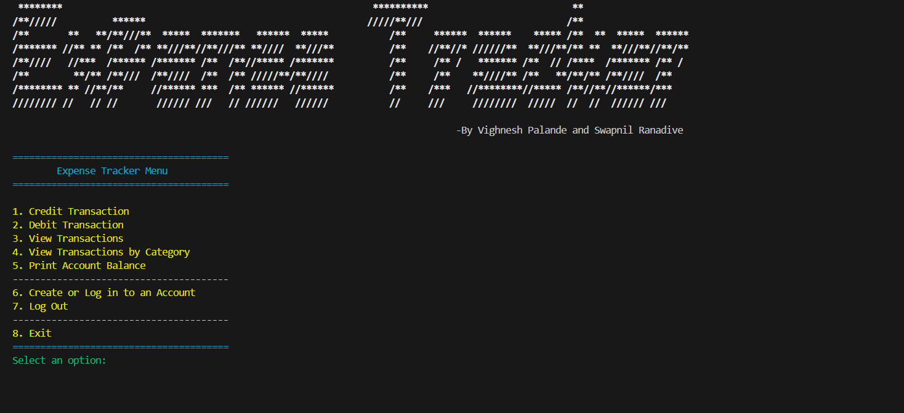

# Expense Tracker

Expense Tracker is a terminal based Java application that helps you manage your personal finances by keeping track of your income and expenses. 
You can add transactions, categorize them, and view your transaction history.

The code primarily utilizes Java HashMaps to manage transactions, account balances, and descriptions, along with LinkedLists to store transaction details, enabling efficient data organization and retrieval.

The output of the code is as follows:

